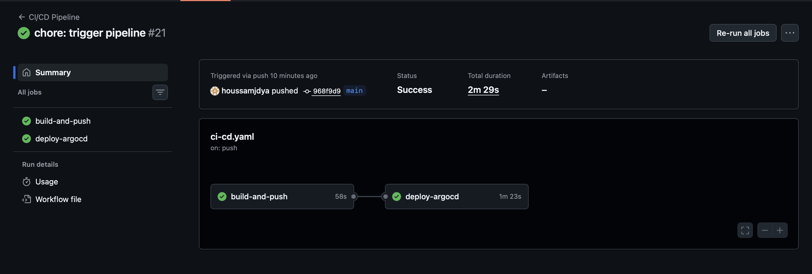
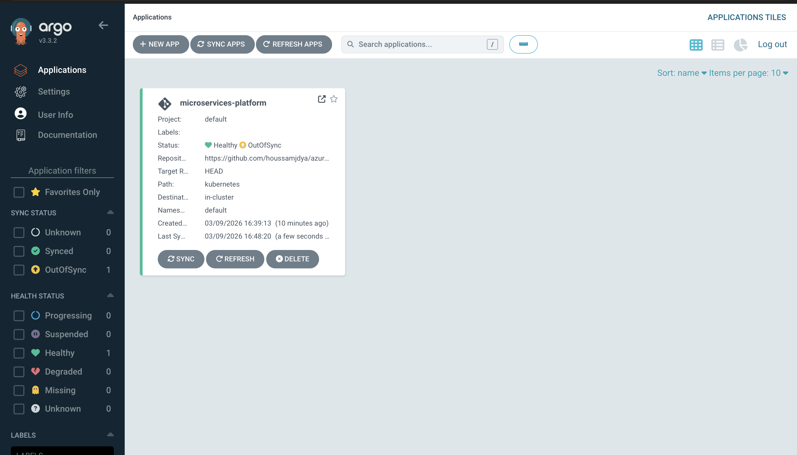
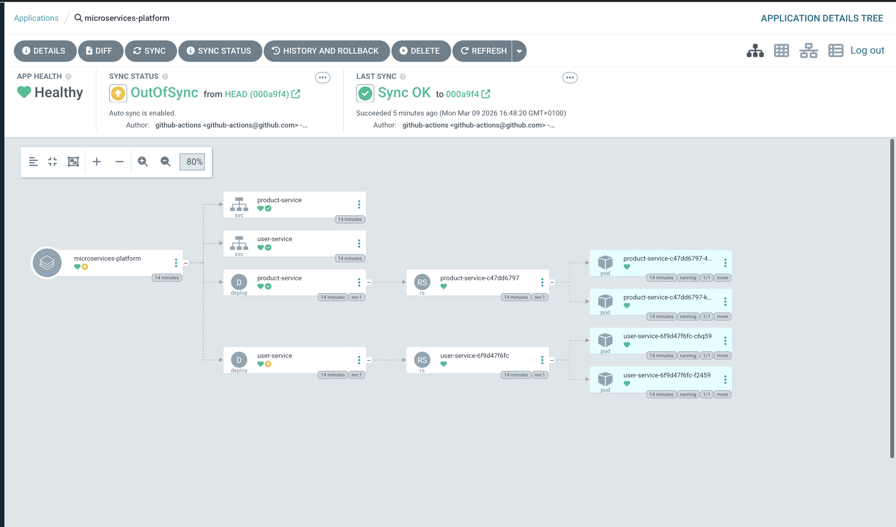
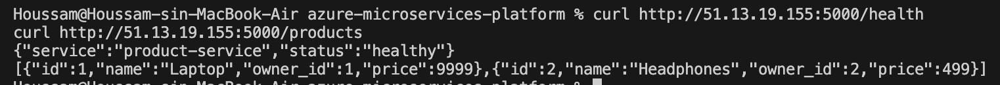

# Azure Microservices Platform


A production-ready microservices platform deployed on Azure Kubernetes Service (AKS), demonstrating modern DevOps practices including Infrastructure as Code, GitOps, and CI/CD automation.

## Motivation

This project was built to demonstrate practical DevOps skills in a real cloud environment. Rather than following a tutorial, the goal was to build a complete platform from scratch – making real architectural decisions, troubleshooting real problems, and understanding why each tool was chosen.

## Key Design Decisions

**Why AKS over Azure App Service?**
AKS provides full Kubernetes control, enabling horizontal scaling, health probes, and self-healing capabilities. App Service is simpler but lacks the orchestration features needed for a production microservices platform.

**Why Terraform over ARM Templates?**
Terraform is cloud-agnostic, has a cleaner syntax, and maintains state explicitly. The same skills transfer to AWS and GCP, making it more valuable than Azure-specific ARM templates.

**Why ArgoCD over manual kubectl apply?**
ArgoCD implements GitOps – Git becomes the single source of truth for cluster state. Any manual changes to the cluster are automatically reverted, preventing configuration drift. This is how modern teams deploy at scale.

**Why Managed Identity over service principals with passwords?**
Managed Identity eliminates stored credentials entirely. AKS authenticates to ACR automatically without any secrets that could be leaked or rotated.

**Why GitHub Actions over Azure DevOps?**
GitHub Actions integrates natively with the codebase, keeping CI/CD configuration close to the code. The marketplace has thousands of pre-built actions, reducing boilerplate.

## Architecture
```
┌─────────────┐     ┌──────────────────┐     ┌─────────────────────┐
│   Developer  │────▶│   GitHub Actions  │────▶│  Azure Container    │
│   pushes     │     │   - Build images  │     │  Registry (ACR)     │
│   to main    │     │   - Push to ACR   │     └──────────┬──────────┘
└─────────────┘     │   - Update tags   │                │
                    └──────────────────┘                │
                                                        ▼
┌─────────────┐     ┌──────────────────┐     ┌─────────────────────┐
│   Azure      │◀────│   ArgoCD         │◀────│  GitHub             │
│   Kubernetes │     │   - Monitors Git  │     │  kubernetes/        │
│   Service    │     │   - Auto syncs    │     │  manifests          │
└─────────────┘     └──────────────────┘     └─────────────────────┘
```

## Tech Stack

| Category | Technology |
|----------|-----------|
| Cloud | Microsoft Azure |
| Container Orchestration | Kubernetes (AKS) |
| Infrastructure as Code | Terraform |
| CI/CD | GitHub Actions |
| GitOps | ArgoCD |
| Container Registry | Azure Container Registry |
| Monitoring | Azure Monitor + Log Analytics |
| Language | Python (Flask) |

## Services

**user-service** – REST API for user management
- `GET /users` – list all users
- `GET /users/:id` – get user by ID
- `GET /health` – health check

**product-service** – REST API for product management
- `GET /products` – list all products
- `GET /products/:id` – get product with owner details
- `GET /health` – health check

## Infrastructure

Provisioned with Terraform:
- Azure Kubernetes Service (AKS) with 2 nodes
- Azure Container Registry (ACR)
- Log Analytics Workspace
- Azure Monitor with alerting

## CI/CD Pipeline

Every push to `main` triggers the GitHub Actions pipeline:
1. Build Docker images for both services
2. Push images to ACR with commit SHA tag
3. Update Kubernetes manifests with new image tags
4. ArgoCD detects changes and syncs to AKS automatically

## GitOps

ArgoCD monitors the `kubernetes/` directory and ensures the cluster always matches the desired state in Git. Self-healing is enabled – any manual changes to the cluster are automatically reverted.

## Screenshots

### CI/CD Pipeline


### ArgoCD Dashboard




### Services Running


## Getting Started

### Prerequisites
- Azure CLI
- Terraform
- kubectl

### Deploy Infrastructure
```bash
cd terraform
terraform init
terraform apply
```

### Connect to AKS
```bash
az aks get-credentials \
  --resource-group rg-microservices-platform \
  --name aks-microservices-platform
```

### Verify Deployment
```bash
kubectl get pods -n default
kubectl get services -n default
```

## Future Improvements

- Migrate from GitHub Secrets to Workload Identity Federation for keyless authentication
- Complete Azure Key Vault integration for secrets management
- Add Horizontal Pod Autoscaler for automatic scaling
- Implement Helm charts instead of raw Kubernetes manifests
- Add Trivy container security scanning in CI/CD pipeline
- Multi-environment setup (dev/staging/prod)
- Add SSL/TLS with ingress controller

## Lessons Learned

- Infrastructure as Code with Terraform enables reproducible environments
- GitOps with ArgoCD ensures cluster state always matches Git
- Health probes are critical for production-ready Kubernetes deployments
- Managed Identity eliminates the need for stored credentials
